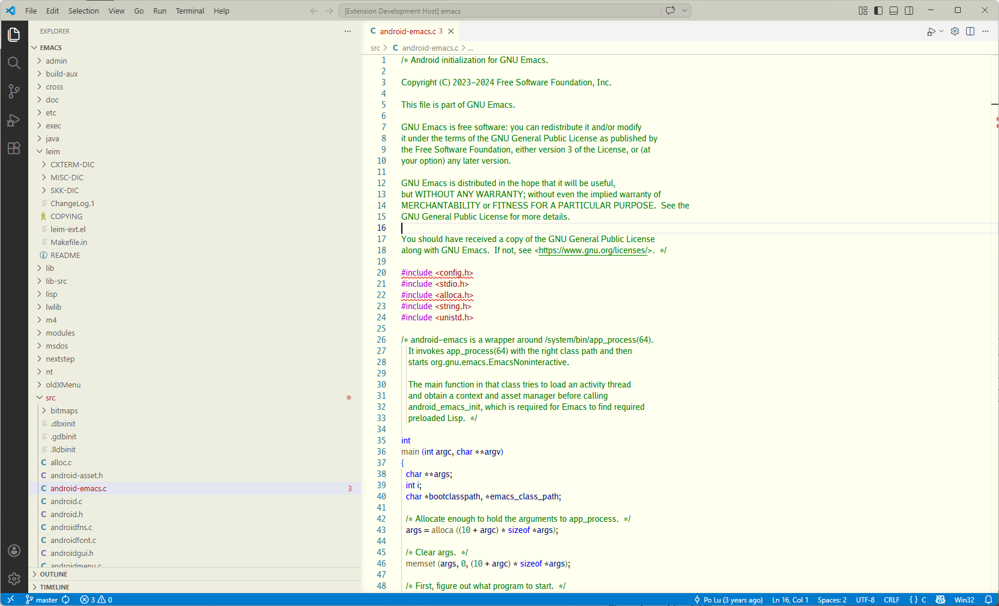
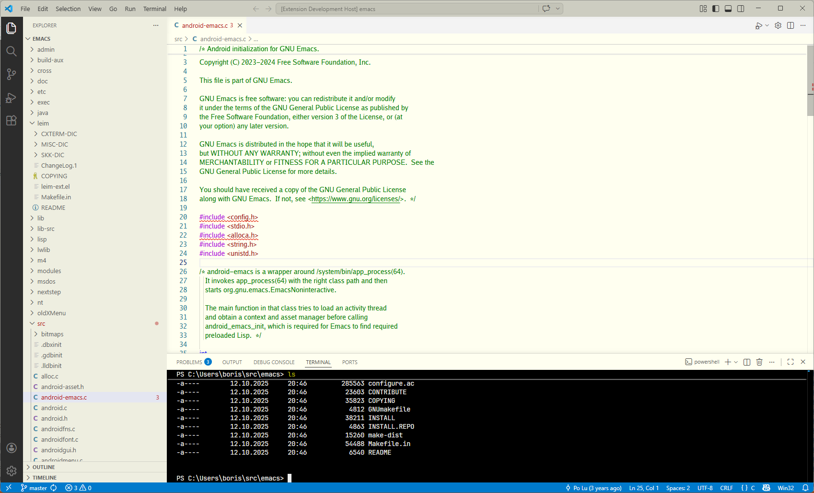
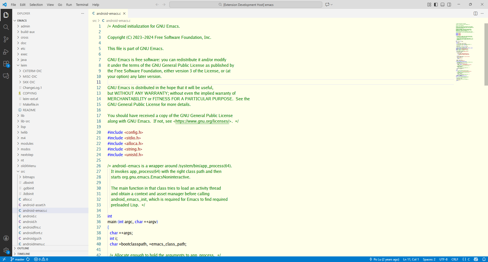
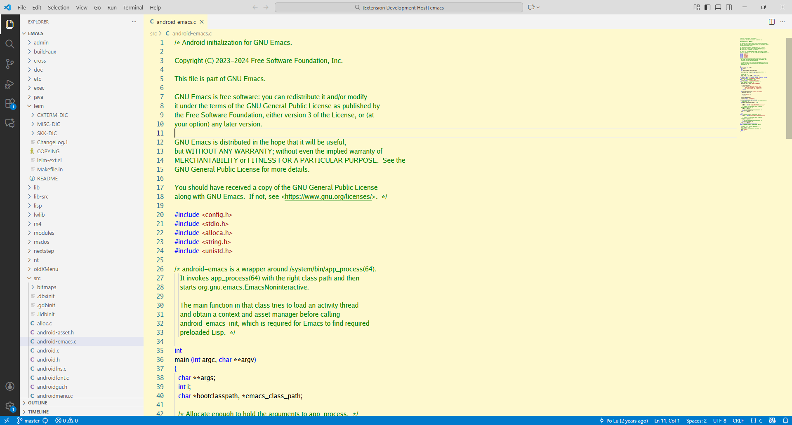
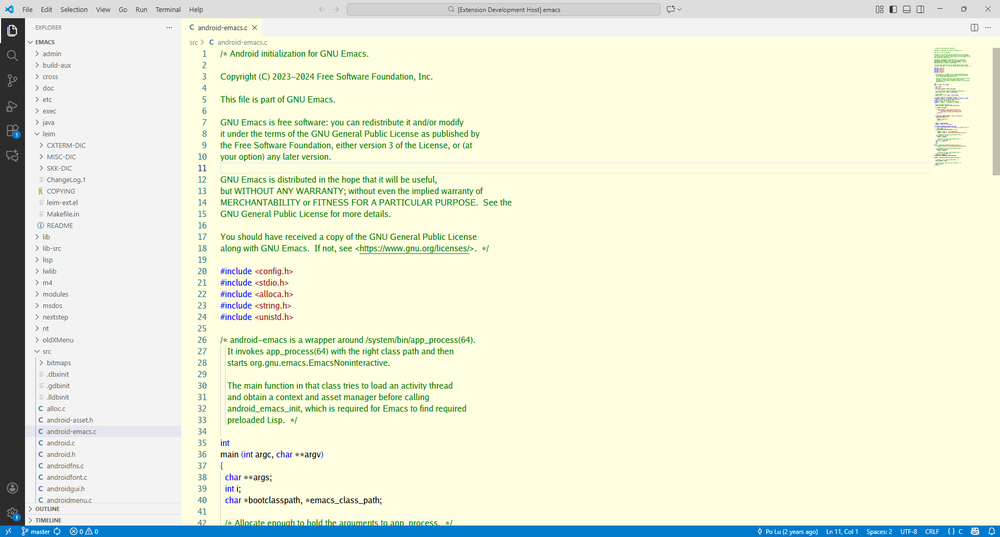
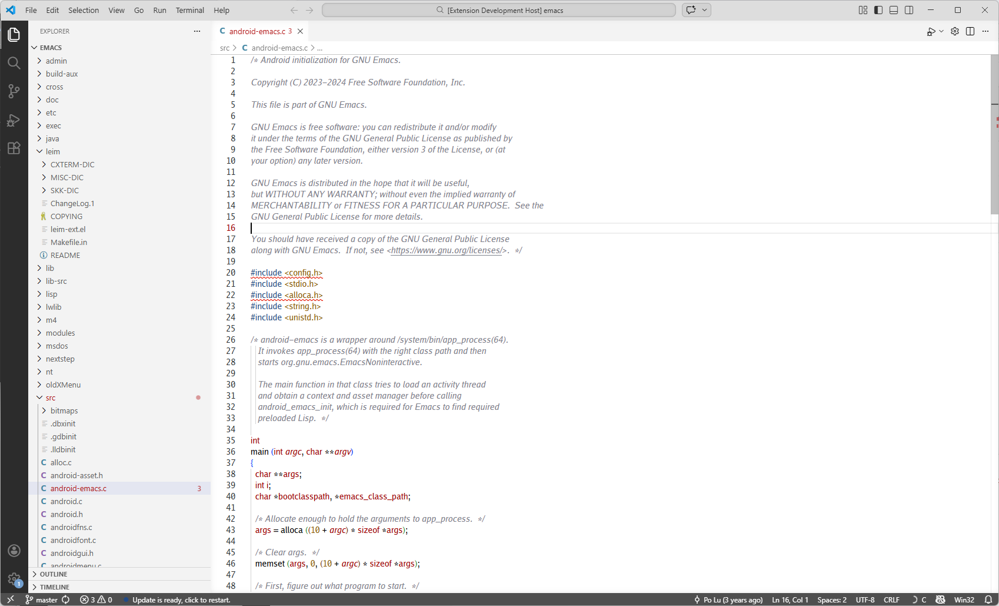
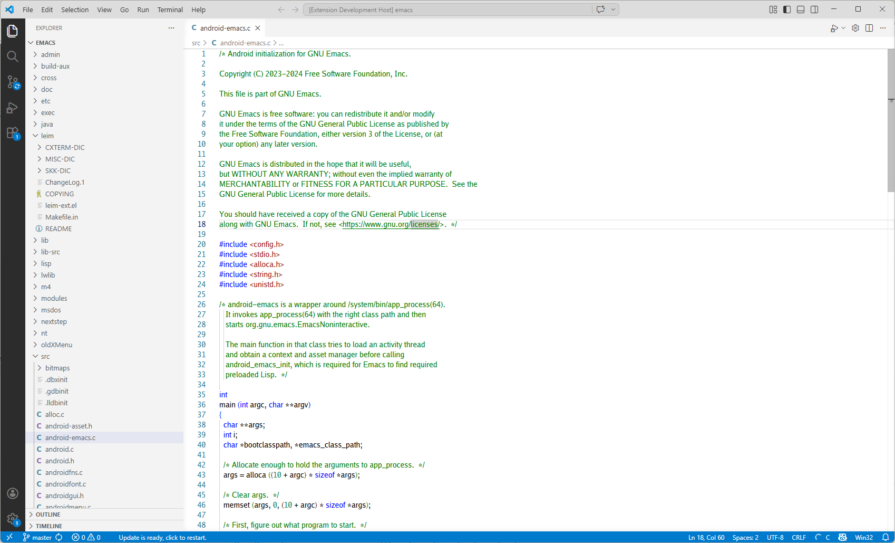

# ivory color scheme

The following is a verbatim copy of this theme: [vscode-tango-plus-theme](https://github.com/ludwigkr/vscode-tango-plus-theme) which is also published under the MIT license.  It is included here mainly for preservation purposes.

The following is a verbatim copy of the original VSCode Visual Studio theme, which is also published under the MIT license.  It is included here mainly for preservation purposes.
